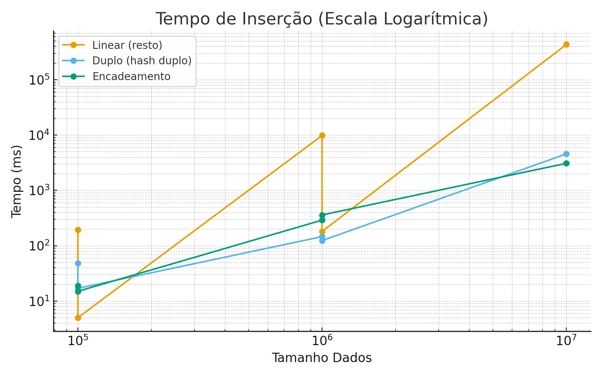
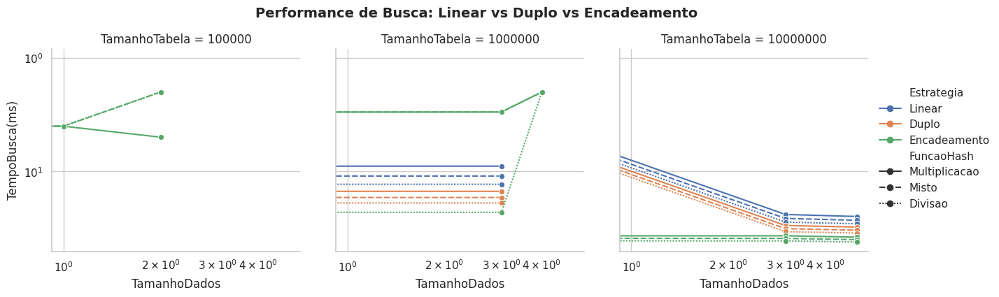
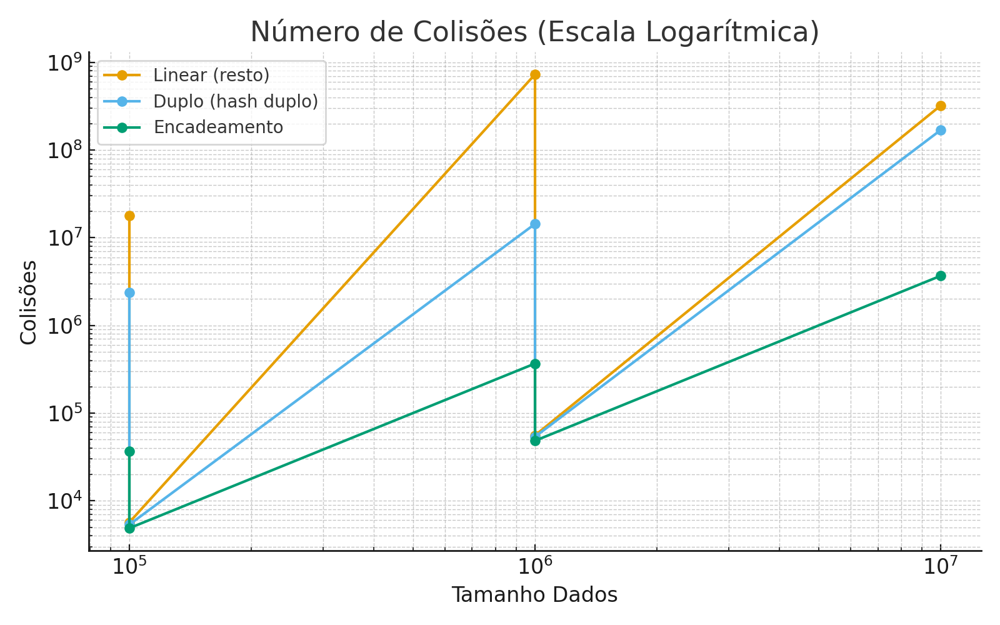
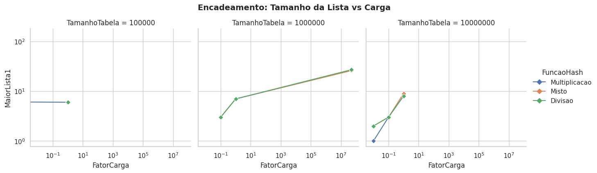

#  Análise de Desempenho – Tabelas Hash  
**Autores:** Fernando Aschwanden, André Esteves, Gustavo Jansen  
**Disciplina:** Estruturas de Dados  
**Item 5 – Inserção, Busca e Gaps nas Estruturas Hash**

---

##  1. Descrição do Experimento

O objetivo deste experimento foi **medir o tempo de busca de elementos** em diferentes implementações de **tabelas hash**:

- **Linear (Sondagem Linear)**
- **Duplo Hashing**
- **Encadeamento Separado**

Para cada estrutura, foram testadas combinações de **tamanho da tabela** e **quantidade de dados inseridos**, com diferentes **fatores de carga** (α).  
Além disso, foram coletadas métricas adicionais, como:
- número de **colisões**,  
- **maiores listas encadeadas** (para o encadeamento separado),  
- **menor, maior e média de gaps** (distância entre posições ocupadas).

---

##  2. Resultados Experimentais

| Tabela Hash           | Tamanho Tabela | Tamanho Dados | Tempo Inserção (ms) | Colisões | Fator de Carga | Tempo Busca (ms) | 3 Maiores Listas | Menor Gap | Maior Gap | Gap Médio |
| --------------------- | -------------- | -------------- | ------------------- | -------- | --------------- | ---------------- | ---------------- | ---------- | ---------- | ---------- |
| Linear (resto)        | 100.000        | 100.000        | 196                 | 17.947.209 | 1 | 1.035 | N/A | 1 | 1 | 1 |
| Linear (resto)        | 1.000.000      | 100.000        | 5                   | 5.684     | 0.1 | 9 | N/A | 1 | 114 | 10 |
| Linear (resto)        | 1.000.000      | 1.000.000      | 9.801               | 730.425.103 | 1 | 135.753 | N/A | 1 | 1 | 1 |
| Linear (resto)        | 10.000.000     | 1.000.000      | 181                 | 55.737    | 0.1 | 252 | N/A | 1 | 145 | 10 |
| Linear (resto)        | 10.000.000     | 10.000.000     | 431.278             | 322.050.043 | 1 | 4.561.847 | N/A | 1 | 1 | 1 |
| Duplo (hash duplo)    | 100.000        | 100.000        | 48                  | 2.367.138 | 1 | 105 | N/A | 1 | 2 | 1 |
| Duplo (hash duplo)    | 1.000.000      | 100.000        | 17                  | 5.352     | 0.1 | 0 | N/A | 1 | 112 | 10 |
| Duplo (hash duplo)    | 1.000.000      | 1.000.000      | 146                 | 14.385.323 | 1 | 2.611 | N/A | 1 | 2 | 1 |
| Duplo (hash duplo)    | 10.000.000     | 1.000.000      | 124                 | 53.765    | 0.1 | 159 | N/A | 1 | 145 | 1 |
| Duplo (hash duplo)    | 10.000.000     | 10.000.000     | 4.551               | 169.167.094 | 1 | 49.409 | N/A | 1 | 2 | 1 |
| Encadeamento          | 100.000        | 100.000        | 19                  | 36.717    | 1 | 32 | 7, 6, 6 | N/A | N/A | N/A |
| Encadeamento          | 1.000.000      | 100.000        | 15                  | 4.874     | 0.1 | 21 | 3, 3, 3 | N/A | N/A | N/A |
| Encadeamento          | 1.000.000      | 1.000.000      | 290                 | 367.659   | 1 | 515 | 8, 7, 7 | N/A | N/A | N/A |
| Encadeamento          | 10.000.000     | 1.000.000      | 360                 | 48.400    | 0.1 | 306 | 3, 3, 3 | N/A | N/A | N/A |
| Encadeamento          | 10.000.000     | 10.000.000     | 3.079               | 3.680.879 | 1 | 5.371 | 8, 8, 8 | N/A | N/A | N/A |

---

##  3. Gráficos Comparativos (Escala Logarítmica)

###  Tempo de Inserção

> Observa-se crescimento logarítmico no tempo de inserção conforme o número de elementos aumenta, com pior desempenho no método **Linear (resto)** em alta carga.

---

###  Tempo de Busca

> A busca no **encadeamento separado** mostrou-se mais estável mesmo com alto fator de carga.  
> O **hash duplo** foi o mais eficiente em baixa carga (α = 0.1).

---

###  Número de Colisões

> O método de **sondagem linear** apresentou o maior número de colisões sob fator de carga 1, o que explica seus altos tempos de inserção e busca.

---

###  3 Maiores Listas Encadeadas

> As listas cresceram conforme o fator de carga se aproximou de 1, atingindo até 8 elementos.

---

###  Gaps Entre Elementos

> O gap médio foi constante (≈1) nas tabelas saturadas e mais espaçado nas tabelas com fator de carga 0.1, evidenciando maior dispersão.

---

##  4. Conclusões

- O desempenho é **fortemente impactado pelo fator de carga (α)**.  
- **Hash Duplo** apresentou o **melhor custo-benefício**, com tempos baixos e poucas colisões.  
- **Encadeamento Separado** teve **maior estabilidade** com α=1, enquanto a **Sondagem Linear** degradou fortemente.  
- Em cenários reais, **α ≤ 0.75** é recomendado para sondagem linear e hash duplo.  
- A **distribuição dos gaps** reflete diretamente a dispersão e eficiência da função hash.

##  5. Ferramentas Utilizadas

- **Java** – Implementação das tabelas hash  
- **Python (Pandas + Matplotlib)** – Análise e geração dos gráficos  

---

> *Trabalho desenvolvido para o RA de Estruturas de Dados, com ênfase na análise empírica de funções hash e estratégias de resolução de colisões.*

